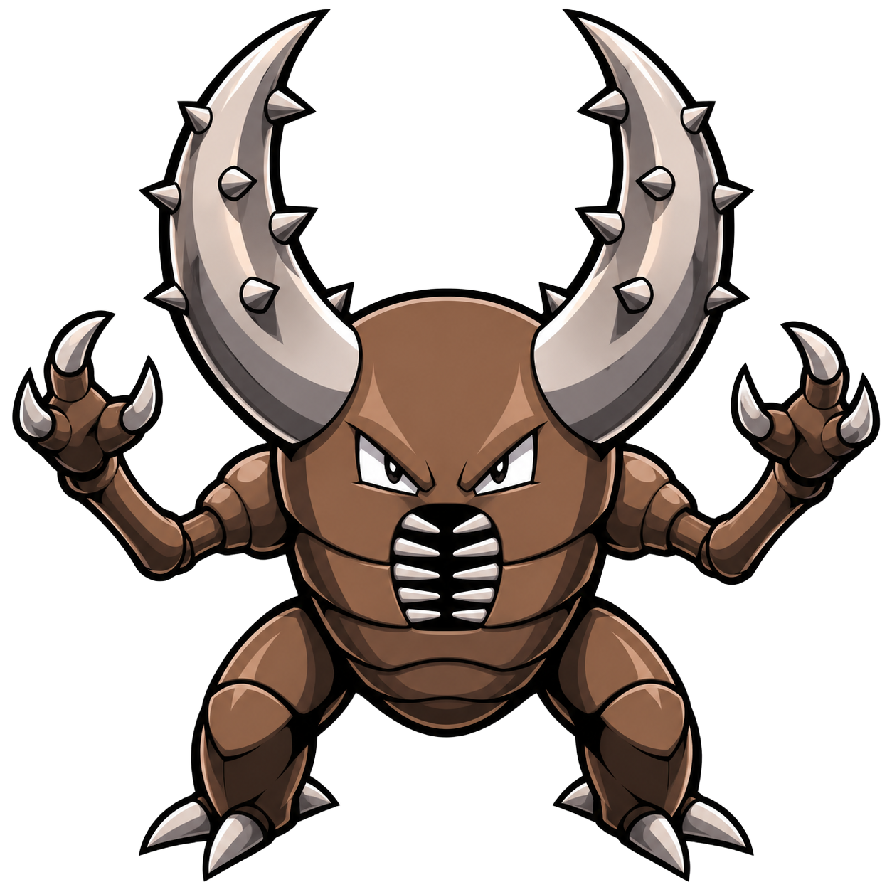
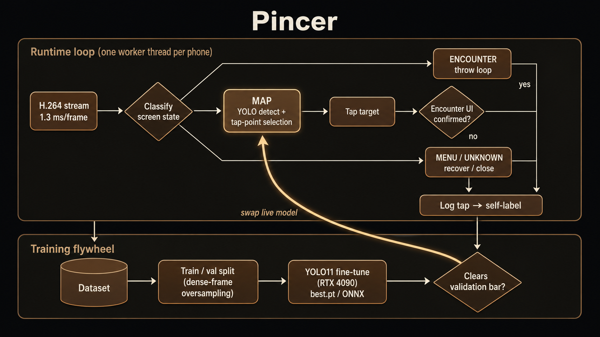

<div align="center">



# Pincer

**A real-time computer-vision agent that drives physical Android phones to play a mobile game autonomously — with a self-supervised data flywheel that continuously retrains its own object detector.**


</div>

> *Two arms, closing in.* A pincer locks onto a target and seizes it — and a pincer movement coordinates two devices at once. Both are the design: precise vision-guided actuation, running in parallel across phones.

The system streams live video off one or more phones over USB, locates game targets with a fine-tuned **YOLO11** detector, and executes the tap/throw gestures to catch them — closing the perception → decision → actuation loop in ~5 seconds, end to end. Every action it takes is logged, human-reviewable, and folded back into the next training set.

Built from scratch in Python: real-time video pipeline, on-device actuation, a custom object detector trained on **5,400+ self-collected frames**, a live web dashboard, and a human-in-the-loop labeling UI. **127 automated tests.**

---

## Highlights

- **Fine-tuned object detector.** YOLO11-small trained on the project's own data reaches **mAP@50 = 0.84, precision 0.81, recall 0.77** on a held-out validation split (1080×2388 phone frames, 1280px inference). Two classes — `pokemon` (act on) and `avoid` (hard-negative UI/landmark hitboxes) — so the agent learns not just *what to hit* but *what to leave alone*.
- **Self-supervised data flywheel.** The agent labels its own training data: every confirmed success writes a YOLO-format frame, and every mis-tap that opens a menu writes a hard-negative `avoid` box. Running the bot *is* the data-collection campaign — the dataset grew from ~2 frames to **5,445 labeled frames (4,589 target + 1,533 negative boxes)** just by operating.
- **Human-in-the-loop review UI.** A browser voting interface turns every tap into a labeled card (Good / Bad + reason). Verified votes flow straight back into the dataset as ground-truth positives, negatives, and recall labels — the correction loop that drives each retrain.
- **Sub-millisecond perception.** A continuous H.264 stream (`adb screenrecord` piped into a PyAV decode thread) cut per-frame capture from **~600 ms to ~1.3 ms**; a persistent input shell cut each tap from **~200 ms to ~20 ms**. The result is animation-bound, near the physical floor.
- **Self-healing, multi-device orchestration.** One worker thread per phone, auto-detecting which devices are connected. The runtime rebuilds a wedged input channel after consecutive no-effect taps, wakes a sleeping screen, and recovers from unexpected menus by template-matching the on-screen close button — no human babysitting.
- **Live monitoring dashboard.** A dependency-free MJPEG server streams each phone's annotated feed at 15 fps (detected boxes, chosen tap point, per-phone counters, pause/resume) so operation is observable in real time.

---

## Architecture



**Perception → decision → actuation, verified at every step.** Two structural safety invariants are enforced in code *and* covered by tests: the agent never actuates a throw until the target UI is confirmed present, and its recovery path can never itself trigger one. This is the difference between a demo and something that runs unattended for hours.

## The detector & training pipeline

| Stage | What happens |
|-------|--------------|
| **Collect** | Live operation self-labels frames: confirmed catches → positive boxes, menu-opening mis-taps → `avoid` negatives. Thread-safe so multiple phones write concurrently. |
| **Review** | Web UI surfaces every tap as a votable card; human labels correct the auto-labels and add hard cases. |
| **Split** | `training/prepare_split.py` builds a train/val layout and **oversamples dense multi-object frames** (rare, high-value supervision) on the train split only — held-out metrics stay honest. |
| **Train** | `training/train_yolo.py` fine-tunes YOLO11 from a COCO-pretrained backbone at 1280px on an RTX 4090, with axis-aligned-safe augmentation (no warping of a rectilinear UI). Exports `.pt` + ONNX. |
| **Gate & ship** | New weights train to a *separate* directory and only replace the live model after clearing the validation bar — the running agent never regresses silently. |

The choice of a purpose-trained YOLO was itself an experiment: a 3B-parameter open-vocabulary localization model was evaluated and **ruled out by measurement** (99 s/frame, zero game sprites found — out of distribution). A ~5–10 ms fine-tuned detector wins decisively when capture latency dominates anyway.

## Benchmarks

Live model (YOLO11s, held-out validation):

| Metric | Value |
|--------|-------|
| mAP@50 | **0.84** |
| mAP@50–95 | **0.66** |
| Precision | **0.81** |
| Recall | **0.77** |
| Inference latency | ~5–10 ms (RTX 4090) |
| End-to-end catch | ~5.3 s, back-to-back |

> 📊 **Expanded stats coming.** A retrain on the full 5,445-frame, 2-class dataset is in
> progress; once it's gated, this section will carry the updated model metrics plus live
> operational figures (catch rate, empty-tap %, panel-tap %, catches/hour). See
> [`ROADMAP.md`](ROADMAP.md).

## Tech stack

**Python** · **YOLO11 / Ultralytics** · **PyTorch (CUDA, RTX 4090)** · **OpenCV** · **PyAV (H.264)** · **ADB / Android instrumentation** · **NumPy** · stdlib **HTTP/MJPEG** servers (zero web deps) · **pytest** (127 tests)

## Engineering notes

- **Latency-first design.** Every wait polls a cheap predicate on the wall clock and proceeds the instant the screen changes, so an action resolves in one animation rather than a worst-case timeout.
- **Measured, not guessed.** Detector rejection rules and tap-point heuristics were each derived from thresholds measured on hand-verified ground truth, not hand-tuned by eye — the review loop produced every one of them.
- **Robust device I/O.** Screen capture uses raw framebuffer capture + pull with hard timeouts (the naive `exec-out` path hangs indefinitely under load); every ADB call is timeout-bounded so a flaky USB link can never freeze the loop.

## Running it

```bash
# Tests
./venv/Scripts/python.exe -m pytest -q                          # 127 passing

# Live (drives whatever phones are connected)
./venv/Scripts/python.exe -m src.runner --config config.json

# Smoke test without touching a phone
./venv/Scripts/python.exe -m src.runner --config config.json --once --dry-run
```

Live monitor: **http://127.0.0.1:8750** · Review/labeling UI: **/review**

Requires USB debugging authorized on each device and ADB (platform-tools) installed. Model training uses a separate CUDA/Ultralytics environment (see `HANDOFF.md`).

## Repository layout

```
pincer/
├── src/                    # the agent
│   ├── runner.py           # multi-phone orchestration (one worker thread per device)
│   ├── catch_loop.py       # perception→decision→actuation state machine
│   ├── device.py           # ADB I/O: H.264 stream, persistent input shell, raw capture
│   ├── screen_state.py     # screen classifier (map / encounter / menu) + template matching
│   ├── detector.py         # classical-CV detector + self-labeling (dataset writers)
│   ├── detector_yolo.py    # LIVE detector: fine-tuned YOLO11 + tap-point selection
│   ├── monitor.py          # live MJPEG dashboard (annotated feed, counters, controls)
│   └── review.py           # human-in-the-loop labeling / voting UI
├── training/               # ML pipeline
│   ├── prepare_split.py    # train/val split + dense-frame oversampling
│   └── train_yolo.py       # YOLO11 fine-tune + ONNX export
├── tests/                  # 127 tests + real-frame fixtures
├── assets/                 # logo + media
├── docs/MODEL.md           # model card (data, training, metrics, experiments)
├── HANDOFF.md              # full architecture / roadmap
└── config.json             # devices, anchors, timing, detector selection
```

*Not tracked (see `.gitignore`): `dataset/` (self-collected training data), `training/runs/` (weights), `experiments/` (CUDA training venv), `venv/`.*

## Roadmap

- 🔨 Retrain the detector on the full 5,445-frame, 2-class dataset; gate and ship.
- ⏳ Publish expanded model + live operational stats (see [Benchmarks](#benchmarks)).
- ⏳ Sustained two-phone live run; slim the runtime to `onnxruntime` (drop `torch`).
- ⏳ Move the monitor/review UI from web to a packaged desktop app.

Full roadmap → [`ROADMAP.md`](ROADMAP.md).

---

*A personal research project exploring real-time computer vision, on-device automation, and self-improving ML data pipelines. Not affiliated with or endorsed by the game's publisher.*
